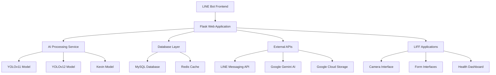

# 🏥 智能藥品管理 LINE Bot

<div align="center">


**一個功能完整的 LINE Bot 智能藥品管理系統**

[功能特色](#-功能特色) • [快速開始](#-快速開始) • [部署指南](#-部署) • [API 文檔](#-api-文檔) • [貢獻指南](#-貢獻)

</div>

---

## 📋 目錄

- [功能特色](#-功能特色)
- [系統架構](#-系統架構)
- [快速開始](#-快速開始)
- [環境配置](#-環境配置)
- [功能模組](#-功能模組)
- [API 文檔](#-api-文檔)
- [部署](#-部署)
- [開發指南](#-開發指南)
- [故障排除](#-故障排除)
- [貢獻](#-貢獻)
- [授權](#-授權)

## 🌟 功能特色

### 🔍 智能藥品辨識
- **多模型 AI 辨識**：整合 YOLOv11、YOLOv12 和 Kevin 專用模型
- **高精度檢測**：支援單一模型和多模型並行辨識
- **即時圖片分析**：拍照即可識別藥品資訊
- **標註圖片回傳**：提供檢測結果的視覺化標註

### 💊 智能用藥管理
- **個人化提醒**：自訂用藥時間和頻率
- **處方籤管理**：掃描處方籤自動建立提醒
- **用藥記錄**：完整的服藥歷史追蹤
- **劑量管理**：精確的用藥劑量控制

### 👨‍👩‍👧‍👦 家庭成員管理
- **多成員支援**：管理全家人的用藥情況
- **權限控制**：家長可管理孩童用藥
- **共享提醒**：家庭成員間的用藥提醒共享
- **健康報告**：家庭健康狀況統計

### 📊 健康記錄系統
- **生理數據記錄**：血壓、血糖、體重等
- **症狀追蹤**：記錄身體不適和改善情況
- **報告生成**：自動生成健康趨勢報告
- **醫療整合**：支援匯出給醫療機構

### 🔐 安全與隱私
- **LINE Login 整合**：安全的身份驗證
- **資料加密**：敏感資料加密儲存
- **權限管理**：細緻的功能權限控制
- **隱私保護**：符合個資保護法規

## 🏗️ 系統架構



### 技術棧

**後端框架**
- **Flask 2.3+**: 輕量級 Web 框架
- **Python 3.11+**: 現代 Python 特性支援
- **Gunicorn**: WSGI HTTP 伺服器

**AI & 機器學習**
- **YOLO Models**: 物件檢測和藥品辨識
- **Google Gemini**: 自然語言處理
- **OpenCV**: 圖像處理

**資料庫 & 儲存**
- **MySQL 8.0+**: 主要資料庫
- **Redis**: 快取和會話管理
- **Google Cloud Storage**: 圖片和檔案儲存

**整合服務**
- **LINE Messaging API**: 聊天機器人功能
- **LINE Login**: 使用者認證
- **LIFF**: LINE 前端框架

**部署 & DevOps**
- **Google Cloud Run**: 容器化部署
- **Docker**: 應用程式容器化
- **GitHub Actions**: CI/CD 自動化

## 🚀 快速開始

### 環境需求

- **Python**: 3.11 或更高版本
- **MySQL**: 8.0 或更高版本
- **Redis**: 6.0 或更高版本（可選，用於快取）
- **Docker**: 20.10+ 或更高版本（用於部署）

### 本地開發設置

#### 1. 克隆專案

```bash
git clone https://github.com/your-username/pill-management-linebot.git
cd pill-management-linebot
```

#### 2. 建立虛擬環境

```bash
# 使用 venv
python -m venv venv

# Windows
venv\Scripts\activate

# macOS/Linux
source venv/bin/activate
```

#### 3. 安裝依賴

```bash
pip install --upgrade pip
pip install -r requirements.txt
```

#### 4. 環境變數設定

```bash
# 複製環境變數範本
cp .env.example .env

# 編輯 .env 檔案
nano .env  # 或使用您偏好的編輯器
```

#### 5. 資料庫設置

```bash
# 建立 MySQL 資料庫
mysql -u root -p
CREATE DATABASE pill_management;
CREATE USER 'pill_user'@'localhost' IDENTIFIED BY 'your_password';
GRANT ALL PRIVILEGES ON pill_management.* TO 'pill_user'@'localhost';
FLUSH PRIVILEGES;
EXIT;
```

#### 6. 啟動應用程式

```bash
# 開發模式
python run.py

# 或使用 Flask CLI
export FLASK_APP=run.py
export FLASK_ENV=development
flask run
```

應用程式將在 `http://localhost:5000` 啟動。

### Docker 快速啟動

```bash
# 建構 Docker 映像
docker build -t pill-management-bot .

# 啟動容器
docker run -p 5000:5000 --env-file .env pill-management-bot
```

### Docker Compose 啟動

```bash
# 啟動所有服務（包含 MySQL 和 Redis）
docker-compose up -d

# 查看日誌
docker-compose logs -f

# 停止服務
docker-compose down
```

## ⚙️ 環境配置

### 必要環境變數

創建 `.env` 檔案並設定以下變數：

```bash
# LINE Bot API 設定
LINE_CHANNEL_ACCESS_TOKEN=your_channel_access_token
LINE_CHANNEL_SECRET=your_channel_secret
YOUR_BOT_ID=your_bot_id

# LIFF 應用程式設定
LIFF_CHANNEL_ID=your_liff_channel_id
LIFF_ID_CAMERA=your_camera_liff_id
LIFF_ID_EDIT=your_edit_liff_id
LIFF_ID_PRESCRIPTION_REMINDER=your_prescription_liff_id
LIFF_ID_MANUAL_REMINDER=your_manual_liff_id
LIFF_ID_HEALTH_FORM=your_health_liff_id

# LINE Login 設定
LINE_LOGIN_CHANNEL_ID=your_login_channel_id
LINE_LOGIN_CHANNEL_SECRET=your_login_channel_secret

# 資料庫設定
DB_HOST=localhost
DB_USER=pill_user
DB_PASS=your_password
DB_NAME=pill_management
DB_PORT=3306

# Google Cloud 設定
GEMINI_API_KEY=your_gemini_api_key
GCS_BUCKET_NAME=your_gcs_bucket_name
GOOGLE_APPLICATION_CREDENTIALS=path/to/credentials.json

# 應用程式設定
SECRET_KEY=your_secret_key_change_this_in_production
FLASK_ENV=development
```

### 可選環境變數

```bash
# Redis 設定（快取功能）
REDIS_URL=redis://localhost:6379/0

# 日誌設定
LOG_LEVEL=INFO
LOG_FILE=app.log

# AI 模型設定
PILL_API_URLS=https://your-model-api-1.com,https://your-model-api-2.com

# 安全設定
SESSION_TIMEOUT=3600
MAX_UPLOAD_SIZE=10485760  # 10MB
```

### 設定驗證

啟動應用程式前，可以驗證設定：

```bash
python -c "
from config import Config
try:
    Config.validate_config()
    print('✅ 所有必要設定已完成')
except ValueError as e:
    print(f'❌ 設定錯誤: {e}')
"
```

## 🧩 功能模組

### 藥品辨識模組

```python
# 使用範例
from app.services.ai_processor import AIProcessor

processor = AIProcessor()
result = processor.detect_pills(image_data)
```

**支援的辨識模式：**
- **單一模型**：選擇特定 AI 模型進行辨識
- **多模型並行**：同時使用多個模型提高準確度
- **智能選擇**：根據圖片特徵自動選擇最佳模型

### 提醒系統

```python
# 建立用藥提醒
from app.services.reminder_service import ReminderService

reminder_service = ReminderService()
reminder_service.create_reminder(
    user_id="user123",
    medication_name="阿斯匹靈",
    dosage="100mg",
    frequency="每日一次",
    time="08:00"
)
```

### 家庭管理

```python
# 家庭成員管理
from app.services.family_service import FamilyService

family_service = FamilyService()
family_service.add_member(
    family_id="family123",
    member_name="小明",
    relationship="兒子",
    birth_date="2010-01-01"
)
```

## 📚 API 文檔

### LINE Webhook API

#### 接收訊息
```http
POST /webhook
Content-Type: application/json

{
  "events": [
    {
      "type": "message",
      "message": {
        "type": "text",
        "text": "藥丸辨識"
      }
    }
  ]
}
```

### 藥品辨識 API

#### 上傳圖片辨識
```http
POST /api/detect
Content-Type: multipart/form-data

file: [image file]
model: "single" | "multi"
```

**回應範例：**
```json
{
  "success": true,
  "detections": [
    {
      "drug_id": "A006271100",
      "confidence": 0.95,
      "class_name": "阿斯匹靈",
      "bbox": [100, 150, 200, 250]
    }
  ],
  "model_name": "YOLOv11",
  "elapsed_time": 2.34,
  "annotated_image_url": "https://storage.googleapis.com/..."
}
```

### 提醒管理 API

#### 建立提醒
```http
POST /api/reminders
Content-Type: application/json

{
  "user_id": "user123",
  "medication_name": "阿斯匹靈",
  "dosage": "100mg",
  "frequency": "daily",
  "times": ["08:00", "20:00"]
}
```

#### 查詢提醒
```http
GET /api/reminders?user_id=user123
```

### 健康記錄 API

#### 新增健康記錄
```http
POST /api/health-records
Content-Type: application/json

{
  "user_id": "user123",
  "type": "blood_pressure",
  "value": {
    "systolic": 120,
    "diastolic": 80
  },
  "recorded_at": "2024-01-15T08:00:00Z"
}
```

## 🚀 部署

### Google Cloud Run 部署

#### 自動部署（推薦）

1. **設定 GitHub Secrets**
   ```bash
   # 在 GitHub 倉庫設定中添加以下 Secrets
   GCP_SA_KEY=<your-service-account-key>
   LINE_CHANNEL_ACCESS_TOKEN=<your-token>
   # ... 其他環境變數
   ```

2. **推送到 main 分支**
   ```bash
   git push origin main
   ```

   GitHub Actions 將自動：
   - 執行測試
   - 建構 Docker 映像
   - 部署到 Google Cloud Run

#### 手動部署

```bash
# 1. 建構並推送映像
docker build -t gcr.io/YOUR_PROJECT_ID/pill-management-bot .
docker push gcr.io/YOUR_PROJECT_ID/pill-management-bot

# 2. 部署到 Cloud Run
gcloud run deploy pill-management-bot \
  --image gcr.io/YOUR_PROJECT_ID/pill-management-bot \
  --platform managed \
  --region us-central1 \
  --allow-unauthenticated \
  --set-env-vars="LINE_CHANNEL_ACCESS_TOKEN=your_token,..."
```

### 其他部署選項

#### Heroku 部署
```bash
# 安裝 Heroku CLI 後
heroku create your-app-name
heroku config:set LINE_CHANNEL_ACCESS_TOKEN=your_token
git push heroku main
```

#### AWS ECS 部署
```bash
# 使用 AWS CLI 和 ECS CLI
ecs-cli configure --cluster pill-management --default-launch-type EC2
ecs-cli up --keypair your-keypair --capability-iam --size 2 --instance-type t3.medium
ecs-cli compose --file docker-compose.yml up
```

### 部署後設定

1. **設定 LINE Webhook URL**
   ```
   https://your-domain.com/webhook
   ```

2. **設定 LIFF 應用程式 URL**
   ```
   https://your-domain.com/liff/camera
   https://your-domain.com/liff/edit
   ```

3. **驗證部署**
   ```bash
   curl https://your-domain.com/health
   ```

## 🛠️ 開發指南

### 專案結構

```
pill-management-linebot/
├── app/                          # 主應用程式目錄
│   ├── __init__.py              # Flask 應用程式工廠
│   ├── routes/                  # 路由模組
│   │   ├── auth.py             # 認證相關路由
│   │   ├── line_webhook.py     # LINE Webhook 處理
│   │   ├── liff_views.py       # LIFF 頁面路由
│   │   └── handlers/           # 訊息處理器
│   │       ├── pill_handler.py    # 藥品辨識處理
│   │       ├── reminder_handler.py # 提醒功能處理
│   │       └── family_handler.py   # 家庭管理處理
│   ├── services/               # 業務邏輯服務
│   │   ├── ai_processor.py     # AI 處理服務
│   │   ├── reminder_service.py # 提醒服務
│   │   ├── family_service.py   # 家庭管理服務
│   │   └── user_service.py     # 使用者服務
│   ├── utils/                  # 工具模組
│   │   ├── db.py              # 資料庫工具
│   │   ├── helpers.py         # 輔助函數
│   │   └── flex/              # LINE Flex Message 模板
│   └── templates/              # HTML 模板
├── kevin_model_handler.py       # Kevin 模型處理器
├── config.py                   # 應用程式配置
├── run.py                      # 應用程式入口點
├── requirements.txt            # Python 依賴
├── Dockerfile                  # Docker 配置
├── docker-compose.yml          # Docker Compose 配置
├── .github/workflows/          # GitHub Actions 工作流程
└── docs/                       # 文檔目錄
```

### 開發工作流程

#### 1. 功能開發

```bash
# 建立功能分支
git checkout -b feature/new-feature

# 開發功能
# ... 編寫程式碼 ...

# 執行測試
python -m pytest tests/

# 程式碼檢查
flake8 app/
black app/

# 提交變更
git add .
git commit -m "feat: add new feature"
git push origin feature/new-feature
```

#### 2. 測試

```bash
# 執行所有測試
python -m pytest

# 執行特定測試
python -m pytest tests/test_pill_detection.py

# 測試覆蓋率
python -m pytest --cov=app tests/
```

#### 3. 程式碼品質

```bash
# 程式碼格式化
black app/

# 程式碼檢查
flake8 app/

# 型別檢查
mypy app/

# 安全檢查
bandit -r app/
```

## 🔧 故障排除

### 常見問題

#### 1. LINE Webhook 驗證失敗

**問題**：收到 "Invalid signature" 錯誤

**解決方案**：
```python
# 檢查 Channel Secret 設定
print(f"Channel Secret: {Config.LINE_CHANNEL_SECRET}")

# 確認 Webhook URL 設定正確
# https://your-domain.com/webhook
```

#### 2. 藥品辨識失敗

**問題**：AI 模型無法辨識藥品

**解決方案**：
```bash
# 檢查模型 API 狀態
curl -X POST https://your-model-api.com/detect \
  -F "file=@test_image.jpg"

# 檢查圖片格式和大小
file test_image.jpg
```

#### 3. 資料庫連線問題

**問題**：無法連接到 MySQL 資料庫

**解決方案**：
```bash
# 測試資料庫連線
mysql -h $DB_HOST -u $DB_USER -p$DB_PASS $DB_NAME

# 檢查防火牆設定
telnet $DB_HOST $DB_PORT
```

#### 4. GCS 上傳失敗

**問題**：圖片無法上傳到 Google Cloud Storage

**解決方案**：
```bash
# 檢查認證檔案
export GOOGLE_APPLICATION_CREDENTIALS=path/to/credentials.json
gsutil ls gs://your-bucket-name

# 檢查權限
gsutil iam get gs://your-bucket-name
```

詳細的 GCS 設置指南請參考 [GCS_SETUP_GUIDE.md](GCS_SETUP_GUIDE.md)。

## 🤝 貢獻

我們歡迎所有形式的貢獻！

### 貢獻方式

1. **回報問題**：在 [Issues](https://github.com/your-username/pill-management-linebot/issues) 頁面回報 Bug
2. **功能建議**：提出新功能的想法和建議
3. **程式碼貢獻**：提交 Pull Request
4. **文檔改善**：改善文檔和範例

### 開發流程

1. **Fork 專案**
   ```bash
   git clone https://github.com/your-username/pill-management-linebot.git
   ```

2. **建立功能分支**
   ```bash
   git checkout -b feature/amazing-feature
   ```

3. **提交變更**
   ```bash
   git commit -m 'feat: add amazing feature'
   ```

4. **推送分支**
   ```bash
   git push origin feature/amazing-feature
   ```

5. **建立 Pull Request**

### 程式碼規範

- **Python**: 遵循 [PEP 8](https://pep8.org/) 規範
- **提交訊息**: 使用 [Conventional Commits](https://conventionalcommits.org/) 格式
- **測試**: 新功能需要包含對應的測試
- **文檔**: 更新相關文檔和 README

### 測試指南

```bash
# 執行所有測試
python -m pytest

# 測試覆蓋率
python -m pytest --cov=app

# 程式碼品質檢查
flake8 app/
black --check app/
```

## 📄 授權

本專案採用 MIT 授權條款 - 詳見 [LICENSE](LICENSE) 檔案。

## 🙏 致謝

- [LINE Developers](https://developers.line.biz/) - LINE Bot API 和 LIFF 框架
- [Flask](https://flask.palletsprojects.com/) - Web 框架
- [Google Cloud](https://cloud.google.com/) - 雲端服務平台
- [YOLO](https://github.com/ultralytics/yolov5) - 物件檢測模型

## 📞 聯絡我們

- **專案維護者**：[Your Name](mailto:your.email@example.com)
- **問題回報**：[GitHub Issues](https://github.com/your-username/pill-management-linebot/issues)
- **功能建議**：[GitHub Discussions](https://github.com/your-username/pill-management-linebot/discussions)

---

<div align="center">

**⭐ 如果這個專案對您有幫助，請給我們一個星星！**

Made with ❤️ by [Your Team Name]

</div>